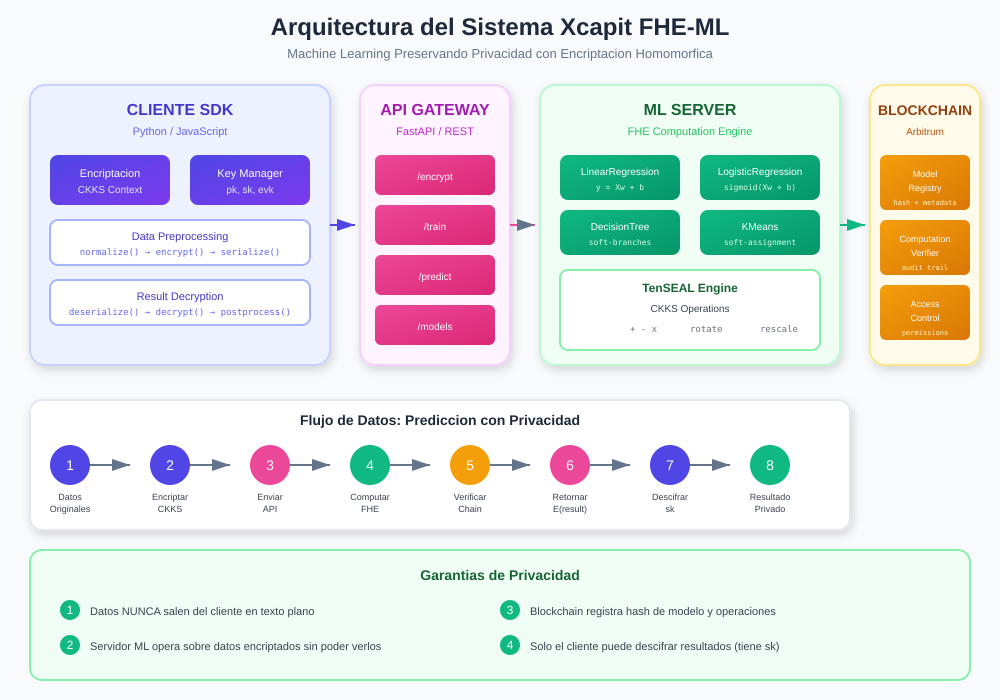

# Capítulo 5: Arquitectura General

## 5.1 Visión General



Xcapit FHE-ML está diseñado como un sistema distribuido con cuatro componentes principales:

```
┌─────────────────────────────────────────────────────────────────────┐
│                    COMPONENTES DEL SISTEMA                           │
├─────────────────────────────────────────────────────────────────────┤
│                                                                       │
│   1. CLIENT SDK          2. API GATEWAY                              │
│   ─────────────          ───────────────                             │
│   • Encriptación         • REST endpoints                            │
│   • Gestión de claves    • Autenticación                            │
│   • Pre/post-proceso     • Rate limiting                             │
│                                                                       │
│   3. ML SERVER           4. BLOCKCHAIN                               │
│   ────────────           ────────────                                │
│   • Modelos FHE          • Model Registry                            │
│   • TenSEAL engine       • Computation Verifier                      │
│   • Inferencia           • Access Control                            │
│                                                                       │
└─────────────────────────────────────────────────────────────────────┘
```

---

## 5.2 Arquitectura por Capas

### 5.2.1 Capa de Presentación (Client SDK)

```python
# Estructura del SDK
xcapit_fhe_ml/
├── encryption/
│   ├── context.py      # Configuración CKKS
│   ├── keys.py         # Generación y gestión de claves
│   └── vectors.py      # Vectores encriptados
├── models/
│   ├── base.py         # Clase base FHEModel
│   ├── linear.py       # Regresión lineal
│   ├── logistic.py     # Regresión logística
│   ├── tree.py         # Árbol de decisión
│   └── kmeans.py       # K-Means clustering
├── api/
│   ├── client.py       # Cliente HTTP
│   └── server.py       # Servidor FastAPI
├── blockchain/
│   ├── connector.py    # Conexión Arbitrum
│   └── registry.py     # Model Registry client
└── utils/
    ├── preprocessing.py
    ├── serialization.py
    └── approximations.py
```

### 5.2.2 Capa de API (Gateway)

```
┌─────────────────────────────────────────────────────────────────────┐
│                        API ENDPOINTS                                 │
├─────────────────────────────────────────────────────────────────────┤
│                                                                       │
│   POST /models                  Crear nuevo modelo                   │
│   GET  /models/{id}            Obtener información del modelo        │
│   POST /models/{id}/train      Entrenar modelo                       │
│   POST /models/{id}/predict    Realizar predicción                   │
│                                                                       │
│   POST /encrypt                Encriptar datos                       │
│   POST /decrypt                Descifrar resultados                  │
│                                                                       │
│   GET  /keys/public            Obtener clave pública                 │
│   POST /keys/generate          Generar nuevo par de claves           │
│                                                                       │
│   GET  /blockchain/verify      Verificar modelo en blockchain        │
│   POST /blockchain/register    Registrar modelo                      │
│                                                                       │
└─────────────────────────────────────────────────────────────────────┘
```

### 5.2.3 Capa de Lógica de Negocio (ML Server)

```python
class FHEMLServer:
    """Servidor de ML con soporte FHE."""

    def __init__(self):
        self.models = {}
        self.context_manager = ContextManager()

    async def create_model(self, config: ModelConfig) -> str:
        """Crea un nuevo modelo según configuración."""
        model = self._instantiate_model(config.model_type)
        model_id = generate_uuid()
        self.models[model_id] = model
        return model_id

    async def train(self, model_id: str, X_enc, y_enc=None):
        """Entrena modelo sobre datos encriptados."""
        model = self.models[model_id]

        # Operaciones FHE sobre ciphertexts
        model.fit_encrypted(X_enc, y_enc)

        # Registrar en blockchain (opcional)
        if self.blockchain_enabled:
            await self.register_training(model_id)

    async def predict(self, model_id: str, X_enc):
        """Predicción sobre datos encriptados."""
        model = self.models[model_id]
        return model.predict_encrypted(X_enc)
```

### 5.2.4 Capa de Persistencia (Blockchain)

```solidity
// ModelRegistry.sol - Arbitrum
contract ModelRegistry {
    struct Model {
        bytes32 weightsHash;
        string architecture;
        uint256 version;
        address owner;
        uint256 registeredAt;
    }

    mapping(bytes32 => Model) public models;

    event ModelRegistered(
        bytes32 indexed modelId,
        bytes32 weightsHash,
        address owner
    );

    function registerModel(
        bytes32 modelId,
        bytes32 weightsHash,
        string memory architecture
    ) external {
        models[modelId] = Model({
            weightsHash: weightsHash,
            architecture: architecture,
            version: 1,
            owner: msg.sender,
            registeredAt: block.timestamp
        });
        emit ModelRegistered(modelId, weightsHash, msg.sender);
    }
}
```

---

## 5.3 Flujo de Datos

### 5.3.1 Flujo de Entrenamiento

```
┌─────────────────────────────────────────────────────────────────────┐
│                    FLUJO DE ENTRENAMIENTO                            │
├─────────────────────────────────────────────────────────────────────┤
│                                                                       │
│   CLIENTE                                                            │
│   ┌─────────────────┐                                                │
│   │ 1. Cargar datos │                                                │
│   │    X_train      │                                                │
│   └────────┬────────┘                                                │
│            │                                                          │
│            ▼                                                          │
│   ┌─────────────────┐                                                │
│   │ 2. Preprocesar  │  Normalizar, escalar                          │
│   │    X_norm       │                                                │
│   └────────┬────────┘                                                │
│            │                                                          │
│            ▼                                                          │
│   ┌─────────────────┐                                                │
│   │ 3. Encriptar    │  CKKS.encrypt(X_norm)                         │
│   │    E(X)         │                                                │
│   └────────┬────────┘                                                │
│            │                                                          │
│   ─────────┼─────────────────────────────────────────────────────    │
│            │                                                          │
│   SERVIDOR │                                                          │
│            ▼                                                          │
│   ┌─────────────────┐                                                │
│   │ 4. Entrenar     │  model.fit(E(X), y)                           │
│   │    modelo FHE   │  (pesos en texto plano)                       │
│   └────────┬────────┘                                                │
│            │                                                          │
│            ▼                                                          │
│   ┌─────────────────┐                                                │
│   │ 5. Registrar    │  hash(pesos) → blockchain                     │
│   │    en chain     │                                                │
│   └────────┬────────┘                                                │
│            │                                                          │
│            ▼                                                          │
│   ┌─────────────────┐                                                │
│   │ 6. Retornar     │  model_id, metrics                            │
│   │    resultado    │                                                │
│   └─────────────────┘                                                │
│                                                                       │
└─────────────────────────────────────────────────────────────────────┘
```

### 5.3.2 Flujo de Predicción

```
┌─────────────────────────────────────────────────────────────────────┐
│                     FLUJO DE PREDICCIÓN                              │
├─────────────────────────────────────────────────────────────────────┤
│                                                                       │
│   TIEMPO ────────────────────────────────────────────────►           │
│                                                                       │
│   Cliente           API              Servidor          Blockchain    │
│      │               │                  │                  │         │
│      │──encrypt(X)──▶│                  │                  │         │
│      │               │                  │                  │         │
│      │               │──POST /predict──▶│                  │         │
│      │               │    {E(X)}        │                  │         │
│      │               │                  │                  │         │
│      │               │                  │──verify model───▶│         │
│      │               │                  │                  │         │
│      │               │                  │◀──model valid────│         │
│      │               │                  │                  │         │
│      │               │                  │──FHE compute────▶│         │
│      │               │                  │  y = f(E(X))     │         │
│      │               │                  │                  │         │
│      │               │                  │──log operation──▶│         │
│      │               │                  │                  │         │
│      │               │◀──{E(y)}────────│                  │         │
│      │               │                  │                  │         │
│      │◀──{E(y)}─────│                  │                  │         │
│      │               │                  │                  │         │
│      │──decrypt(E(y),sk)               │                  │         │
│      │               │                  │                  │         │
│      │  y (plaintext)│                  │                  │         │
│      ▼               │                  │                  │         │
│                                                                       │
└─────────────────────────────────────────────────────────────────────┘
```

---

## 5.4 Gestión de Claves

### 5.4.1 Tipos de Claves

```
┌─────────────────────────────────────────────────────────────────────┐
│                      JERARQUÍA DE CLAVES                             │
├─────────────────────────────────────────────────────────────────────┤
│                                                                       │
│   CLAVE SECRETA (sk)                                                 │
│   ──────────────────                                                 │
│   • Almacenada SOLO en cliente                                       │
│   • Nunca transmitida                                                │
│   • Usada para descifrar resultados                                  │
│   • Formato: polinomio con coeficientes pequeños                     │
│                                                                       │
│   CLAVE PÚBLICA (pk)                                                 │
│   ──────────────────                                                 │
│   • Puede compartirse con servidor                                   │
│   • Usada para encriptar datos                                       │
│   • Derivada de sk: pk = (b, a) donde b = -a·sk + e                 │
│                                                                       │
│   CLAVES DE EVALUACIÓN (evk)                                         │
│   ───────────────────────────                                        │
│   • Enviadas al servidor                                             │
│   • Permiten operaciones FHE sin sk                                  │
│   • Incluyen:                                                        │
│     - Relinearization keys (para multiplicación)                     │
│     - Galois keys (para rotaciones)                                  │
│                                                                       │
└─────────────────────────────────────────────────────────────────────┘
```

### 5.4.2 Almacenamiento Seguro

```python
from cryptography.fernet import Fernet
import keyring

class SecureKeyStorage:
    """Almacenamiento seguro de claves FHE."""

    def __init__(self, service_name: str = "xcapit_fhe_ml"):
        self.service_name = service_name
        self._master_key = self._get_or_create_master_key()

    def _get_or_create_master_key(self) -> bytes:
        """Obtiene o crea clave maestra del keyring del sistema."""
        key = keyring.get_password(self.service_name, "master_key")
        if key is None:
            key = Fernet.generate_key().decode()
            keyring.set_password(self.service_name, "master_key", key)
        return key.encode()

    def store_secret_key(self, sk_bytes: bytes, key_id: str):
        """Almacena clave secreta encriptada."""
        fernet = Fernet(self._master_key)
        encrypted = fernet.encrypt(sk_bytes)
        keyring.set_password(
            self.service_name,
            f"sk_{key_id}",
            encrypted.decode()
        )

    def retrieve_secret_key(self, key_id: str) -> bytes:
        """Recupera clave secreta desencriptada."""
        encrypted = keyring.get_password(
            self.service_name,
            f"sk_{key_id}"
        )
        if encrypted is None:
            raise KeyError(f"Key {key_id} not found")
        fernet = Fernet(self._master_key)
        return fernet.decrypt(encrypted.encode())
```

---

## 5.5 Configuración del Contexto CKKS

### 5.5.1 Parámetros de Configuración

```python
class CKKSConfig:
    """Configuración del contexto CKKS."""

    # Configuraciones predefinidas
    PRESETS = {
        "fast": {
            "poly_modulus_degree": 4096,
            "coeff_mod_bit_sizes": [40, 20, 40],
            "scale": 2**20,
            "description": "Rápido, baja precisión, pocas operaciones"
        },
        "balanced": {
            "poly_modulus_degree": 8192,
            "coeff_mod_bit_sizes": [60, 40, 40, 60],
            "scale": 2**40,
            "description": "Balance entre velocidad y precisión"
        },
        "precise": {
            "poly_modulus_degree": 16384,
            "coeff_mod_bit_sizes": [60, 40, 40, 40, 40, 40, 60],
            "scale": 2**40,
            "description": "Alta precisión, más operaciones"
        },
        "ml_optimized": {
            "poly_modulus_degree": 8192,
            "coeff_mod_bit_sizes": [60, 40, 40, 40, 40, 60],
            "scale": 2**40,
            "description": "Optimizado para ML típico"
        }
    }

    @classmethod
    def create_context(cls, preset: str = "ml_optimized"):
        """Crea contexto TenSEAL con preset dado."""
        import tenseal as ts

        config = cls.PRESETS[preset]

        context = ts.context(
            ts.SCHEME_TYPE.CKKS,
            poly_modulus_degree=config["poly_modulus_degree"],
            coeff_mod_bit_sizes=config["coeff_mod_bit_sizes"]
        )

        context.global_scale = config["scale"]
        context.generate_galois_keys()

        return context
```

### 5.5.2 Serialización del Contexto

```python
def serialize_context(context, include_secret_key: bool = False):
    """Serializa contexto para transmisión."""
    if include_secret_key:
        return context.serialize(
            save_secret_key=True,
            save_galois_keys=True,
            save_relin_keys=True
        )
    else:
        # Solo claves públicas y de evaluación
        return context.serialize(
            save_secret_key=False,
            save_galois_keys=True,
            save_relin_keys=True
        )

def deserialize_context(data: bytes):
    """Deserializa contexto desde bytes."""
    import tenseal as ts
    return ts.context_from(data)
```

---

## 5.6 Manejo de Errores

### 5.6.1 Jerarquía de Excepciones

```python
class FHEMLError(Exception):
    """Excepción base para errores de FHE-ML."""
    pass

class EncryptionError(FHEMLError):
    """Error durante encriptación."""
    pass

class DecryptionError(FHEMLError):
    """Error durante descifrado."""
    pass

class ModelError(FHEMLError):
    """Error relacionado con el modelo."""
    pass

class NoiseOverflowError(FHEMLError):
    """Ruido FHE excedió límite."""
    pass

class KeyError(FHEMLError):
    """Error de gestión de claves."""
    pass

class BlockchainError(FHEMLError):
    """Error de interacción con blockchain."""
    pass
```

### 5.6.2 Manejo en la API

```python
from fastapi import HTTPException

@app.exception_handler(NoiseOverflowError)
async def noise_overflow_handler(request, exc):
    return JSONResponse(
        status_code=400,
        content={
            "error": "noise_overflow",
            "message": "FHE noise exceeded threshold. Try with fewer operations.",
            "suggestion": "Use a deeper CKKS configuration or reduce computation depth."
        }
    )

@app.exception_handler(EncryptionError)
async def encryption_handler(request, exc):
    return JSONResponse(
        status_code=400,
        content={
            "error": "encryption_failed",
            "message": str(exc),
            "suggestion": "Check that input data is properly formatted."
        }
    )
```

---

## 5.7 Logging y Monitoreo

### 5.7.1 Configuración de Logging

```python
import logging
from pythonjsonlogger import jsonlogger

def setup_logging():
    """Configura logging estructurado."""
    logger = logging.getLogger("xcapit_fhe_ml")
    handler = logging.StreamHandler()

    formatter = jsonlogger.JsonFormatter(
        "%(timestamp)s %(level)s %(name)s %(message)s"
    )
    handler.setFormatter(formatter)
    logger.addHandler(handler)
    logger.setLevel(logging.INFO)

    return logger

# Uso
logger = setup_logging()

logger.info("Model training started", extra={
    "model_id": model_id,
    "model_type": "logistic_regression",
    "features": 10,
    "samples": 1000
})
```

### 5.7.2 Métricas

```python
from prometheus_client import Counter, Histogram, Gauge

# Métricas de predicción
prediction_counter = Counter(
    "fhe_predictions_total",
    "Total predictions made",
    ["model_type"]
)

prediction_latency = Histogram(
    "fhe_prediction_latency_seconds",
    "Prediction latency",
    ["model_type"]
)

noise_level = Gauge(
    "fhe_noise_level",
    "Current noise level in ciphertext",
    ["operation"]
)
```

---

## 5.8 Resumen

| Componente | Responsabilidad | Tecnología |
|------------|-----------------|------------|
| **Client SDK** | Encriptación, gestión de claves | Python, TenSEAL |
| **API Gateway** | Endpoints REST, autenticación | FastAPI |
| **ML Server** | Modelos FHE, inferencia | TenSEAL, NumPy |
| **Blockchain** | Registro, verificación | Arbitrum, Solidity |

---

**Siguiente capítulo**: [Capa de Encriptación →](02-encryption-layer.md)
