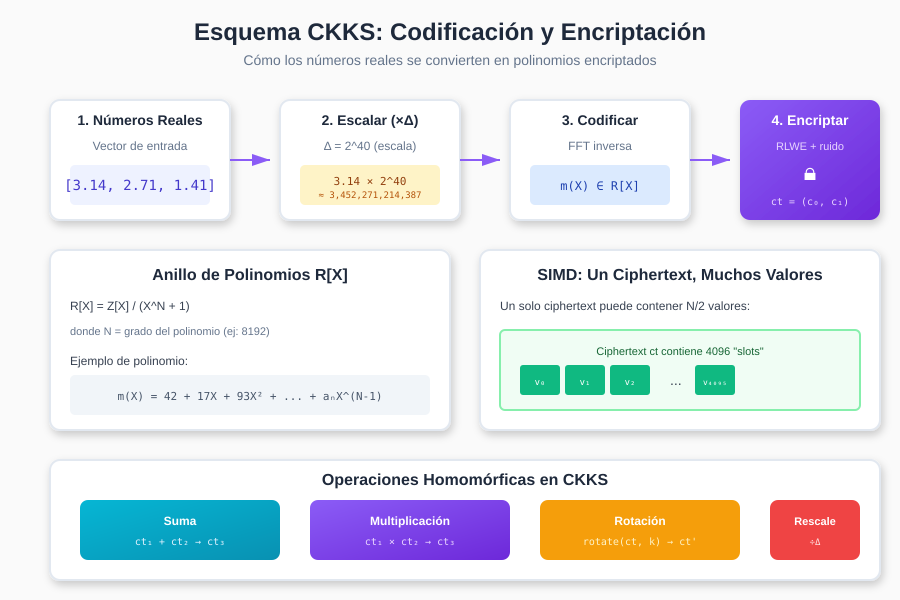

# Capítulo 2: El Esquema CKKS

## 2.1 Introducción a CKKS

El esquema **CKKS** (Cheon-Kim-Kim-Song, 2017) es un esquema de encriptación homomórfica diseñado específicamente para trabajar con **números reales y complejos**. Esto lo hace ideal para Machine Learning, donde los datos y pesos del modelo son típicamente valores decimales.

### ¿Por qué CKKS para ML?

```
┌─────────────────────────────────────────────────────────────────────┐
│                    COMPARACIÓN DE ESQUEMAS FHE                       │
├──────────────┬─────────────────────────────────────────────────────┤
│    BFV/BGV   │   CKKS                                               │
├──────────────┼─────────────────────────────────────────────────────┤
│              │                                                       │
│  Enteros     │   Números Reales                                     │
│  exactos     │   aproximados                                        │
│              │                                                       │
│  [1, 2, 3]   │   [3.14159, 2.71828, 1.41421]                       │
│              │                                                       │
│  Ideal para: │   Ideal para:                                        │
│  • Votación  │   • Machine Learning                                 │
│  • Conteo    │   • Análisis estadístico                            │
│  • Búsqueda  │   • Procesamiento de señales                        │
│              │                                                       │
└──────────────┴─────────────────────────────────────────────────────┘
```

---

## 2.2 Fundamentos Matemáticos

### 2.2.1 Anillo de Polinomios

CKKS opera sobre un **anillo de polinomios ciclotómico**:

```
R = Z[X] / (X^N + 1)
```

**Explicación:**
- `Z[X]`: Polinomios con coeficientes enteros
- `X^N + 1`: Polinomio ciclotómico (típicamente N = 2^k, ej: 4096, 8192, 16384)
- La división modular significa que `X^N = -1`

**Ejemplo con N = 4:**

```
Polinomio en R:  p(X) = 3 + 2X + 5X² + X³

Si multiplicamos por X⁴:
X⁴ ≡ -1 (mod X⁴ + 1)

Entonces:
X⁵ = X · X⁴ = X · (-1) = -X
X⁶ = X² · X⁴ = -X²
...
```

### 2.2.2 El Espacio de Mensajes



En CKKS, los mensajes son **vectores de números complejos**:

```
m = (z₀, z₁, z₂, ..., z_{N/2-1}) ∈ C^{N/2}
```

**Capacidad de slots:**
- Con N = 8192 → 4096 slots (valores independientes)
- Con N = 16384 → 8192 slots

### 2.2.3 Codificación Canónica

La codificación convierte un vector de complejos en un polinomio:

```
Encode: C^{N/2} → R[X]
Decode: R[X] → C^{N/2}
```

**Proceso de Codificación:**

```
┌─────────────────────────────────────────────────────────────────────┐
│                     PROCESO DE CODIFICACIÓN CKKS                     │
├─────────────────────────────────────────────────────────────────────┤
│                                                                       │
│   1. Vector de entrada                                               │
│      m = [3.14, 2.71, 1.41, 0.58]                                   │
│                                                                       │
│   2. Escalar por Δ (factor de escala)                               │
│      m' = m × 2^40                                                   │
│      m' = [3.45×10¹², 2.98×10¹², 1.55×10¹², 6.38×10¹¹]             │
│                                                                       │
│   3. Aplicar transformada inversa (σ⁻¹)                             │
│      Basada en FFT sobre raíces de unidad                           │
│                                                                       │
│   4. Redondear a enteros                                             │
│      p(X) = a₀ + a₁X + a₂X² + ... + a_{N-1}X^{N-1}                  │
│                                                                       │
│   5. El polinomio resultante es el mensaje codificado               │
│                                                                       │
└─────────────────────────────────────────────────────────────────────┘
```

---

## 2.3 Estructura del Ciphertext

Un ciphertext en CKKS es un **par de polinomios**:

```
ct = (c₀, c₁) ∈ R_q × R_q
```

Donde:
- `R_q = Z_q[X] / (X^N + 1)`: Anillo con coeficientes módulo q
- `q`: Módulo del ciphertext (número muy grande, ej: 2^200)

### Relación con el Mensaje

```
c₀ + c₁ · s ≈ m (mod q)
```

Donde `s` es la **clave secreta** (un polinomio con coeficientes pequeños).

### Visualización de un Ciphertext

```
┌─────────────────────────────────────────────────────────────────────┐
│                        ESTRUCTURA DEL CIPHERTEXT                     │
├─────────────────────────────────────────────────────────────────────┤
│                                                                       │
│   ct = (c₀, c₁)                                                      │
│                                                                       │
│   ┌───────────────────────────┐   ┌───────────────────────────┐     │
│   │          c₀               │   │          c₁               │     │
│   │                           │   │                           │     │
│   │  Polinomio de grado N-1   │   │  Polinomio de grado N-1   │     │
│   │  Coeficientes mod q       │   │  Coeficientes mod q       │     │
│   │                           │   │                           │     │
│   │  c₀ = m + e + a·s         │   │  c₁ = -a                  │     │
│   │  (mensaje + ruido +       │   │  (polinomio aleatorio     │     │
│   │   producto con secreto)   │   │   usado en encriptación)  │     │
│   │                           │   │                           │     │
│   └───────────────────────────┘   └───────────────────────────┘     │
│                                                                       │
│   Para descifrar: c₀ + c₁ · s = m + e                               │
│   (e es pequeño, se ignora al decodificar)                          │
│                                                                       │
└─────────────────────────────────────────────────────────────────────┘
```

---

## 2.4 Operaciones Homomórficas

### 2.4.1 Suma Homomórfica

La suma de ciphertexts es **componente a componente**:

```
ct₁ = (c₀⁽¹⁾, c₁⁽¹⁾)   encrypts m₁
ct₂ = (c₀⁽²⁾, c₁⁽²⁾)   encrypts m₂

ct_add = (c₀⁽¹⁾ + c₀⁽²⁾, c₁⁽¹⁾ + c₁⁽²⁾)   encrypts m₁ + m₂
```

**Verificación matemática:**

```
Descifrado de ct_add:
(c₀⁽¹⁾ + c₀⁽²⁾) + (c₁⁽¹⁾ + c₁⁽²⁾) · s
= (c₀⁽¹⁾ + c₁⁽¹⁾ · s) + (c₀⁽²⁾ + c₁⁽²⁾ · s)
= (m₁ + e₁) + (m₂ + e₂)
= (m₁ + m₂) + (e₁ + e₂)   ✓
```

**Crecimiento del ruido:** `e_sum ≈ e₁ + e₂` (lineal)

### 2.4.2 Multiplicación Homomórfica

La multiplicación es más compleja y produce un **ciphertext extendido**:

```
ct₁ = (c₀⁽¹⁾, c₁⁽¹⁾)
ct₂ = (c₀⁽²⁾, c₁⁽²⁾)

ct_mult = (d₀, d₁, d₂)   ← ¡Tres componentes!
```

Donde:
```
d₀ = c₀⁽¹⁾ · c₀⁽²⁾
d₁ = c₀⁽¹⁾ · c₁⁽²⁾ + c₁⁽¹⁾ · c₀⁽²⁾
d₂ = c₁⁽¹⁾ · c₁⁽²⁾
```

**Problema:** El ciphertext ahora tiene 3 componentes.
**Solución:** **Relinearización** - convierte (d₀, d₁, d₂) → (c₀', c₁')

```
┌─────────────────────────────────────────────────────────────────────┐
│                      MULTIPLICACIÓN CON RELINEARIZACIÓN              │
├─────────────────────────────────────────────────────────────────────┤
│                                                                       │
│   ct₁ × ct₂                                                          │
│       │                                                               │
│       ▼                                                               │
│   ┌─────────┐                                                        │
│   │ Tensor  │  (c₀⁽¹⁾, c₁⁽¹⁾) ⊗ (c₀⁽²⁾, c₁⁽²⁾)                      │
│   │ Product │  Resultado: (d₀, d₁, d₂)                               │
│   └────┬────┘                                                        │
│        │                                                              │
│        ▼                                                              │
│   ┌─────────────┐                                                    │
│   │ Relinearizar│  Usa claves de evaluación (evk)                    │
│   │             │  d₂ · s² → convertido a términos lineales          │
│   └──────┬──────┘                                                    │
│          │                                                            │
│          ▼                                                            │
│   ct_result = (c₀', c₁')  ← De vuelta a 2 componentes                │
│                                                                       │
└─────────────────────────────────────────────────────────────────────┘
```

**Crecimiento del ruido:** `e_mult ≈ e₁ · e₂ · Δ` (cuadrático)

### 2.4.3 Rescaling

Después de una multiplicación, la escala se duplica:

```
Antes de mult:  escala = Δ
Después:        escala = Δ²
```

El **rescaling** reduce la escala dividiendo por Δ:

```
Rescale(ct) = ct / Δ

Efecto:
- Reduce la escala de Δ² a Δ
- Reduce el nivel del ciphertext en 1
- Reduce el ruido proporcionalmente
```

```
┌─────────────────────────────────────────────────────────────────────┐
│                          CADENA DE MÓDULOS                           │
├─────────────────────────────────────────────────────────────────────┤
│                                                                       │
│   Nivel L:     q = q₀ · q₁ · q₂ · ... · qₗ                          │
│                                                                       │
│   Después de mult + rescale:                                         │
│                                                                       │
│   Nivel L-1:   q' = q₀ · q₁ · q₂ · ... · q_{L-1}                    │
│                                                                       │
│   Cada multiplicación "consume" un nivel.                            │
│   Cuando llegas a nivel 0, no puedes multiplicar más.                │
│                                                                       │
│   Ejemplo con L = 5:                                                 │
│   ┌─────┬─────┬─────┬─────┬─────┬─────┐                             │
│   │  5  │  4  │  3  │  2  │  1  │  0  │  ← Niveles                  │
│   └──┬──┴──┬──┴──┬──┴──┬──┴──┬──┴─────┘                             │
│      │     │     │     │     │                                        │
│      └──×──┘     └──×──┘     └── No más multiplicaciones             │
│        mult       mult                                                │
│                                                                       │
└─────────────────────────────────────────────────────────────────────┘
```

---

## 2.5 Generación de Claves

CKKS utiliza varios tipos de claves:

### 2.5.1 Tipos de Claves

```
┌─────────────────────────────────────────────────────────────────────┐
│                         SISTEMA DE CLAVES CKKS                       │
├─────────────────────────────────────────────────────────────────────┤
│                                                                       │
│   CLAVE SECRETA (sk)                                                 │
│   ────────────────────                                               │
│   • Polinomio s con coeficientes en {-1, 0, 1}                      │
│   • NUNCA sale del cliente                                           │
│   • Usada para descifrar                                             │
│                                                                       │
│   CLAVE PÚBLICA (pk)                                                 │
│   ────────────────────                                               │
│   • Par (b, a) donde b = -a·s + e                                   │
│   • Puede compartirse con el servidor                                │
│   • Usada para encriptar                                             │
│                                                                       │
│   CLAVES DE EVALUACIÓN (evk)                                         │
│   ────────────────────────────                                       │
│   • Relinearization keys: para multiplicación                        │
│   • Galois keys: para rotaciones                                     │
│   • Necesarias en el servidor para operaciones                       │
│                                                                       │
└─────────────────────────────────────────────────────────────────────┘
```

### 2.5.2 Proceso de Generación

```python
# Pseudocódigo de generación de claves

def generate_keys(N, q, distribution):
    # 1. Generar clave secreta
    s = sample_ternary(N)  # Coeficientes en {-1, 0, 1}

    # 2. Generar clave pública
    a = sample_uniform(N, q)  # Polinomio aleatorio mod q
    e = sample_error(N, sigma)  # Error gaussiano pequeño
    b = -a * s + e  (mod q)
    pk = (b, a)

    # 3. Generar claves de relinearización
    # (para convertir ct de grado 2 a grado 1)
    rlk = generate_relin_keys(s)

    # 4. Generar claves de Galois
    # (para rotaciones en los slots)
    gk = generate_galois_keys(s)

    return sk=s, pk=(b,a), evk=(rlk, gk)
```

---

## 2.6 Encriptación y Descifrado

### 2.6.1 Encriptación

```
Encrypt(pk, m):
    1. Muestrear v ← distribución ternaria
    2. Muestrear e₀, e₁ ← distribución de error
    3. c₀ = b·v + e₀ + m
    4. c₁ = a·v + e₁
    5. return ct = (c₀, c₁)
```

**Visualización:**

```
┌─────────────────────────────────────────────────────────────────────┐
│                         PROCESO DE ENCRIPTACIÓN                      │
├─────────────────────────────────────────────────────────────────────┤
│                                                                       │
│   Mensaje: m(X) = 42 + 17X + 93X² + ...                             │
│                                                                       │
│   Clave pública: pk = (b, a)                                        │
│                                                                       │
│                     ┌────────────────┐                               │
│   Aleatorio v ──────│                │                               │
│                     │   Encriptar    │──── ct = (c₀, c₁)            │
│   Error e₀, e₁ ─────│                │                               │
│                     └────────────────┘                               │
│                           ▲                                          │
│                           │                                          │
│                     ┌─────┴─────┐                                    │
│                     │  Mensaje  │                                    │
│                     │    m(X)   │                                    │
│                     └───────────┘                                    │
│                                                                       │
│   c₀ = b·v + e₀ + m                                                 │
│   c₁ = a·v + e₁                                                     │
│                                                                       │
└─────────────────────────────────────────────────────────────────────┘
```

### 2.6.2 Descifrado

```
Decrypt(sk, ct):
    1. Calcular m' = c₀ + c₁·s
    2. Decodificar m' para obtener el mensaje original
    3. return Decode(m')
```

**Por qué funciona:**

```
c₀ + c₁·s = (b·v + e₀ + m) + (a·v + e₁)·s
          = (-a·s + e)·v + e₀ + m + a·v·s + e₁·s
          = -a·s·v + e·v + e₀ + m + a·v·s + e₁·s
          = m + (e·v + e₀ + e₁·s)
          = m + ruido_pequeño
          ≈ m  ✓
```

---

## 2.7 Operaciones SIMD

Una característica poderosa de CKKS es el procesamiento **SIMD** (Single Instruction, Multiple Data):

### 2.7.1 Slots Paralelos

```
┌─────────────────────────────────────────────────────────────────────┐
│                      PROCESAMIENTO SIMD EN CKKS                      │
├─────────────────────────────────────────────────────────────────────┤
│                                                                       │
│   Un ciphertext contiene N/2 "slots" independientes:                 │
│                                                                       │
│   ct = E([v₀, v₁, v₂, v₃, ..., v_{N/2-1}])                          │
│                                                                       │
│   ┌─────┬─────┬─────┬─────┬─────┬─────┬─────┬─────┐                 │
│   │ v₀  │ v₁  │ v₂  │ v₃  │ ... │     │     │v₄₀₉₅│                 │
│   └─────┴─────┴─────┴─────┴─────┴─────┴─────┴─────┘                 │
│                                                                       │
│   Operación sobre ct afecta TODOS los slots en paralelo:            │
│                                                                       │
│   ct₁ + ct₂ = E([v₀+u₀, v₁+u₁, v₂+u₂, ...])                        │
│                                                                       │
│   ┌─────┬─────┬─────┐     ┌─────┬─────┬─────┐                       │
│   │ v₀  │ v₁  │ v₂  │  +  │ u₀  │ u₁  │ u₂  │                       │
│   └─────┴─────┴─────┘     └─────┴─────┴─────┘                       │
│         ║                       ║                                    │
│         ▼                       ▼                                    │
│   ┌─────────┬─────────┬─────────┐                                   │
│   │  v₀+u₀  │  v₁+u₁  │  v₂+u₂  │                                   │
│   └─────────┴─────────┴─────────┘                                   │
│                                                                       │
│   ¡4096 sumas en UNA sola operación criptográfica!                  │
│                                                                       │
└─────────────────────────────────────────────────────────────────────┘
```

### 2.7.2 Rotaciones

Las **rotaciones** permiten mover datos entre slots:

```
rotate(ct, k):  Rota los slots k posiciones a la izquierda

Ejemplo con k=1:
[v₀, v₁, v₂, v₃, v₄] → [v₁, v₂, v₃, v₄, v₀]
```

**Uso en ML:** Las rotaciones son esenciales para:
- Suma de todos los elementos (reducción)
- Multiplicación matriz-vector
- Convoluciones

```
Suma de todos los slots usando rotaciones:

Inicio:  [1, 2, 3, 4]

Paso 1:  [1, 2, 3, 4] + rotate([1, 2, 3, 4], 2)
       = [1, 2, 3, 4] + [3, 4, 1, 2]
       = [4, 6, 4, 6]

Paso 2:  [4, 6, 4, 6] + rotate([4, 6, 4, 6], 1)
       = [4, 6, 4, 6] + [6, 4, 6, 4]
       = [10, 10, 10, 10]

Resultado: Todos los slots contienen la suma = 10
```

---

## 2.8 Parámetros de CKKS

### 2.8.1 Parámetros Principales

| Parámetro | Símbolo | Descripción | Valores típicos |
|-----------|---------|-------------|-----------------|
| Grado del polinomio | N | Determina seguridad y capacidad | 4096, 8192, 16384 |
| Escala | Δ | Precisión de los números | 2^30, 2^40, 2^50 |
| Módulo inicial | q | Tamaño del espacio de trabajo | 2^100 - 2^400 |
| Niveles | L | Número de multiplicaciones | 5-40 |
| Desviación estándar | σ | Tamaño del error | 3.2 |

### 2.8.2 Trade-offs

```
┌─────────────────────────────────────────────────────────────────────┐
│                          TRADE-OFFS EN CKKS                          │
├──────────────────┬──────────────────────────────────────────────────┤
│   Parámetro      │   Efecto al aumentar                             │
├──────────────────┼──────────────────────────────────────────────────┤
│                  │                                                   │
│   N (grado)      │   + Más seguridad                                │
│                  │   + Más slots (SIMD)                             │
│                  │   - Más lento                                     │
│                  │   - Más memoria                                   │
│                  │                                                   │
├──────────────────┼──────────────────────────────────────────────────┤
│                  │                                                   │
│   Δ (escala)     │   + Más precisión                                │
│                  │   - Menos niveles disponibles                     │
│                  │   - Menos multiplicaciones                        │
│                  │                                                   │
├──────────────────┼──────────────────────────────────────────────────┤
│                  │                                                   │
│   L (niveles)    │   + Más multiplicaciones                         │
│                  │   - Módulo q más grande                          │
│                  │   - Ciphertexts más grandes                       │
│                  │   - Operaciones más lentas                        │
│                  │                                                   │
└──────────────────┴──────────────────────────────────────────────────┘
```

### 2.8.3 Configuraciones Recomendadas

```python
# Configuración para alta precisión, pocas multiplicaciones
config_precision = {
    "poly_modulus_degree": 8192,
    "coeff_mod_bit_sizes": [60, 40, 40, 60],  # L=3
    "scale": 2**40,
    "security_level": 128
}

# Configuración para más operaciones, menor precisión
config_depth = {
    "poly_modulus_degree": 16384,
    "coeff_mod_bit_sizes": [60, 40, 40, 40, 40, 40, 40, 60],  # L=7
    "scale": 2**40,
    "security_level": 128
}

# Configuración para ML típico (balance)
config_ml = {
    "poly_modulus_degree": 8192,
    "coeff_mod_bit_sizes": [60, 40, 40, 40, 40, 60],  # L=5
    "scale": 2**40,
    "security_level": 128
}
```

---

## 2.9 Implementación en TenSEAL

### 2.9.1 Creación de Contexto

```python
import tenseal as ts

# Crear contexto CKKS
context = ts.context(
    ts.SCHEME_TYPE.CKKS,
    poly_modulus_degree=8192,
    coeff_mod_bit_sizes=[60, 40, 40, 60]
)

# Configurar escala
context.global_scale = 2**40

# Generar claves de Galois para rotaciones
context.generate_galois_keys()
```

### 2.9.2 Encriptar y Operar

```python
# Datos originales
data = [3.14, 2.71, 1.41, 0.58]

# Encriptar como vector CKKS
ct = ts.ckks_vector(context, data)

# Operaciones homomórficas
ct_sum = ct + ct          # Suma
ct_prod = ct * ct         # Multiplicación elemento a elemento
ct_scaled = ct * 2.5      # Escalar por constante
ct_neg = -ct              # Negación

# Descifrar
result = ct_sum.decrypt()
print(result)  # [6.28, 5.42, 2.82, 1.16]
```

### 2.9.3 Ejemplo Completo: Producto Punto

```python
import tenseal as ts
import numpy as np

# Configurar contexto
context = ts.context(
    ts.SCHEME_TYPE.CKKS,
    poly_modulus_degree=8192,
    coeff_mod_bit_sizes=[60, 40, 40, 60]
)
context.global_scale = 2**40
context.generate_galois_keys()

# Vectores para producto punto
a = [1.0, 2.0, 3.0, 4.0]
b = [0.5, 1.5, 2.5, 3.5]

# Encriptar
ct_a = ts.ckks_vector(context, a)
ct_b = ts.ckks_vector(context, b)

# Producto punto: sum(a * b)
ct_prod = ct_a * ct_b           # Multiplicación elemento a elemento
result_enc = ct_prod.sum()      # Suma usando rotaciones

# Descifrar
result = result_enc.decrypt()[0]
expected = np.dot(a, b)

print(f"FHE result: {result:.4f}")
print(f"Expected:   {expected:.4f}")
# FHE result: 25.0000
# Expected:   25.0
```

---

## 2.10 Resumen del Capítulo

| Concepto | Descripción |
|----------|-------------|
| **Anillo R** | `Z[X]/(X^N + 1)` - espacio de trabajo de CKKS |
| **Codificación** | Convierte vectores de reales a polinomios |
| **Ciphertext** | Par `(c₀, c₁)` de polinomios |
| **Suma** | Componente a componente, ruido crece linealmente |
| **Multiplicación** | Tensor product + relinearización, ruido crece cuadráticamente |
| **Rescaling** | Divide por Δ para mantener escala manejable |
| **SIMD** | N/2 operaciones paralelas en un ciphertext |
| **Rotaciones** | Mueven datos entre slots para reducciones |

---

## 2.11 Ejercicios

1. **Teórico**: Si N = 8192 y usamos números complejos, ¿cuántos valores reales podemos almacenar en un solo ciphertext?

2. **Práctico**: Implementa una función que calcule la media de un vector encriptado usando rotaciones.

3. **Análisis**: Si comenzamos con L = 5 niveles y cada multiplicación consume un nivel, ¿cuántas multiplicaciones consecutivas podemos hacer?

4. **Diseño**: Para una red neuronal con 3 capas (cada capa necesita 2 multiplicaciones), ¿qué valor mínimo de L necesitamos?

---

**Siguiente capítulo**: [Machine Learning sobre Datos Encriptados →](03-ml-on-encrypted-data.md)
