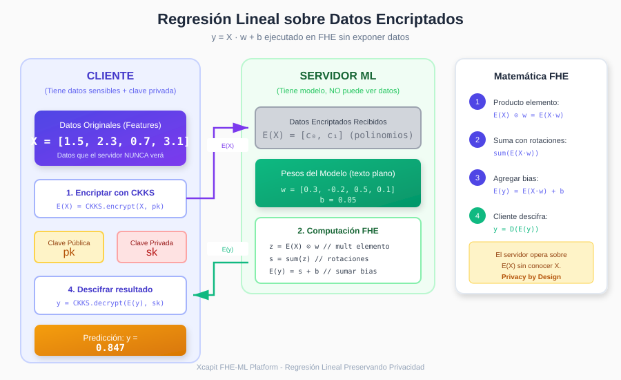

# Capítulo 3: Machine Learning sobre Datos Encriptados

## 3.1 El Desafío del ML con FHE

Ejecutar algoritmos de Machine Learning sobre datos encriptados presenta desafíos únicos que requieren adaptaciones específicas.

### Limitaciones Fundamentales

```
┌─────────────────────────────────────────────────────────────────────┐
│                    DESAFÍOS DE ML CON FHE                            │
├─────────────────────────────────────────────────────────────────────┤
│                                                                       │
│   ❌ NO DISPONIBLE en FHE:                                           │
│   ───────────────────────                                            │
│   • Comparaciones (if x > y)                                         │
│   • Divisiones exactas (a / b)                                       │
│   • Funciones no polinomiales directas (exp, log, sqrt)             │
│   • Acceso condicional a memoria                                     │
│   • Bucles con condición variable                                    │
│                                                                       │
│   ✅ DISPONIBLE en FHE:                                              │
│   ────────────────────                                               │
│   • Sumas y restas                                                   │
│   • Multiplicaciones                                                 │
│   • Evaluación de polinomios                                         │
│   • Rotaciones (SIMD)                                                │
│   • Operaciones matriciales                                          │
│                                                                       │
└─────────────────────────────────────────────────────────────────────┘
```

### Implicaciones para ML

```
┌─────────────────────────────────────────────────────────────────────┐
│            OPERACIÓN ML         │         ADAPTACIÓN FHE            │
├─────────────────────────────────┼───────────────────────────────────┤
│                                 │                                   │
│  Producto punto (w · x)         │  ✓ Directo con mult + rotaciones  │
│                                 │                                   │
│  Sigmoid σ(x)                   │  Aproximación polinomial          │
│                                 │                                   │
│  ReLU max(0, x)                 │  Aproximación cuadrática          │
│                                 │                                   │
│  Softmax                        │  Goldschmidt + polinomios         │
│                                 │                                   │
│  División (normalización)       │  Algoritmo de Newton-Raphson      │
│                                 │                                   │
│  Comparación (árbol decisión)   │  Tablas de lookup o polinomios    │
│                                 │                                   │
└─────────────────────────────────┴───────────────────────────────────┘
```

---

## 3.2 Regresión Lineal Encriptada

La regresión lineal es el modelo más natural para FHE porque solo usa operaciones lineales.

### 3.2.1 Modelo Matemático

```
Predicción:  ŷ = X · w + b

Donde:
- X ∈ ℝⁿˣᵈ  : matriz de features (n muestras, d dimensiones)
- w ∈ ℝᵈ    : vector de pesos
- b ∈ ℝ     : sesgo (bias)
- ŷ ∈ ℝⁿ    : predicciones
```

### 3.2.2 Implementación FHE



```python
class LinearRegressionFHE:
    def __init__(self):
        self.weights = None
        self.bias = None

    def predict_encrypted(self, X_encrypted):
        """
        X_encrypted: Vector CKKS encriptado
        weights, bias: En texto plano (modelo público)

        Operaciones:
        1. X_encrypted * weights  (mult ciphertext-plaintext)
        2. sum(...)               (rotaciones)
        3. + bias                 (suma ciphertext-plaintext)
        """
        # Producto punto encriptado
        weighted = X_encrypted * self.weights

        # Suma usando rotaciones
        result = weighted.sum()

        # Agregar bias
        result = result + self.bias

        return result
```

### 3.2.3 Flujo de Datos

```
┌─────────────────────────────────────────────────────────────────────┐
│                    FLUJO DE REGRESIÓN LINEAL FHE                     │
├─────────────────────────────────────────────────────────────────────┤
│                                                                       │
│  CLIENTE                          SERVIDOR                           │
│  ──────────                       ────────────                       │
│                                                                       │
│  1. Datos originales              3. Recibe E(X)                     │
│     X = [1.5, 2.3, 0.7]              (no puede ver X)                │
│                                                                       │
│  2. Encriptar                     4. Computa sobre E(X)              │
│     E(X) ─────────────────────────►  y = E(X) · w + b                │
│                                      │                               │
│                                      │ (operaciones FHE)             │
│                                      ▼                               │
│  6. Descifrar                     5. Retorna E(ŷ)                    │
│     ŷ = D(E(ŷ)) ◄────────────────── E(ŷ)                            │
│     = 0.847                          │                               │
│                                      (no conoce ŷ)                   │
│                                                                       │
└─────────────────────────────────────────────────────────────────────┘
```

---

## 3.3 Regresión Logística Encriptada

La regresión logística requiere la función sigmoid, que no es un polinomio.

### 3.3.1 El Problema del Sigmoid

```
σ(x) = 1 / (1 + e^(-x))

Esta función:
- Contiene división (1/...)
- Contiene exponencial (e^(-x))
- Ninguna es directamente computable en FHE
```

### 3.3.2 Aproximación Polinomial

Usamos una aproximación de Taylor o minimax:

```
┌─────────────────────────────────────────────────────────────────────┐
│                  APROXIMACIONES DEL SIGMOID                          │
├─────────────────────────────────────────────────────────────────────┤
│                                                                       │
│   Grado 3 (menos preciso, más rápido):                              │
│   σ(x) ≈ 0.5 + 0.197x - 0.004x³                                     │
│                                                                       │
│   Grado 5 (balance):                                                 │
│   σ(x) ≈ 0.5 + 0.197x - 0.004x³ + 0.0001x⁵                         │
│                                                                       │
│   Grado 7 (más preciso, más lento):                                 │
│   σ(x) ≈ 0.5 + 0.197x - 0.004x³ + 0.0001x⁵ - 0.000002x⁷            │
│                                                                       │
│   Rango válido: x ∈ [-5, 5] (fuera de este rango, σ ≈ 0 o 1)       │
│                                                                       │
└─────────────────────────────────────────────────────────────────────┘
```

**Comparación Visual:**

```
  1.0 ┤                          ════════════════
      │                       ═══
      │                    ═══
      │                  ══
  0.5 ┤ ─ ─ ─ ─ ─ ─ ─ ═══ ─ ─ ─ ─ ─ ─ ─ ─ ─ ─ ─
      │              ══
      │           ═══
      │        ═══
  0.0 ┤════════
      └─────┬─────┬─────┬─────┬─────┬─────┬─────►
           -4    -2     0     2     4     6    x

      ──── Sigmoid real
      ═══  Aproximación polinomial (grado 5)
```

### 3.3.3 Implementación

```python
class LogisticRegressionFHE:
    def __init__(self, degree=5):
        self.degree = degree
        self.weights = None
        self.bias = None

        # Coeficientes para aproximación sigmoid
        self.sigmoid_coeffs = self._get_sigmoid_coeffs(degree)

    def _sigmoid_approx(self, x_encrypted):
        """Evalúa polinomio de aproximación del sigmoid."""
        # Usa el método de Horner para eficiencia
        result = x_encrypted * 0  # Inicializar en 0

        for coeff in reversed(self.sigmoid_coeffs):
            result = result * x_encrypted + coeff

        return result

    def predict_encrypted(self, X_encrypted):
        # 1. Combinación lineal: z = X · w + b
        z = (X_encrypted * self.weights).sum() + self.bias

        # 2. Aplicar sigmoid aproximado
        probability = self._sigmoid_approx(z)

        return probability
```

---

## 3.4 Árbol de Decisión Encriptado

Los árboles de decisión presentan un desafío mayor porque dependen de comparaciones.

### 3.4.1 El Problema de las Comparaciones

```
Nodo típico de árbol:
    if x[i] <= threshold:
        go_left()
    else:
        go_right()

En FHE NO podemos:
- Comparar valores encriptados
- Tomar decisiones basadas en datos encriptados
- Acceder condicionalmente a ramas
```

### 3.4.2 Solución: Evaluación de Todas las Ramas

```
┌─────────────────────────────────────────────────────────────────────┐
│              ÁRBOL DE DECISIÓN EN FHE: EVALUACIÓN COMPLETA          │
├─────────────────────────────────────────────────────────────────────┤
│                                                                       │
│   En lugar de elegir una rama, evaluamos TODAS y combinamos:        │
│                                                                       │
│                    ┌─────────┐                                       │
│                    │ x[0]≤5? │                                       │
│                    └────┬────┘                                       │
│                   ╱     │     ╲                                      │
│             P(left)     │     P(right)                               │
│                ╱        │        ╲                                   │
│        ┌──────┐         │         ┌──────┐                          │
│        │ Hoja │         │         │ Hoja │                          │
│        │ v₁   │         │         │ v₂   │                          │
│        └──────┘         │         └──────┘                          │
│                         │                                            │
│   Resultado = P(left) × v₁ + P(right) × v₂                          │
│                                                                       │
│   Donde P(left) = σ(threshold - x[0])  (soft comparison)            │
│         P(right) = 1 - P(left)                                       │
│                                                                       │
└─────────────────────────────────────────────────────────────────────┘
```

### 3.4.3 Comparación Suave (Soft Comparison)

Aproximamos la comparación `x <= t` con una función sigmoide:

```
comparación_suave(x, t, β) = σ(β × (t - x))

Donde:
- t = threshold
- x = valor a comparar
- β = parámetro de "dureza" (β alto → comparación más nítida)
```

```
  1.0 ┤                    ═════════════════
      │                  ══
      │                ══                   β=1 (suave)
  0.5 ┤ ─ ─ ─ ─ ─ ─ ═══ ─ ─ ─ ─ ─ ─ ─ ─ ─
      │            ══
      │          ══
  0.0 ┤══════════
      └─────┬─────┬─────┬─────┬─────┬───►
           -2    -1     0     1     2   x-t

  1.0 ┤                 │═══════════════════
      │                 │
      │                 │                   β=10 (duro)
  0.5 ┤ ─ ─ ─ ─ ─ ─ ─ ─│─ ─ ─ ─ ─ ─ ─ ─ ─
      │                 │
      │                 │
  0.0 ┤═════════════════│
      └─────┬─────┬─────┬─────┬─────┬───►
           -2    -1     0     1     2   x-t
```

### 3.4.4 Implementación

```python
class DecisionTreeFHE:
    def __init__(self, tree_structure, beta=5):
        self.tree = tree_structure
        self.beta = beta

    def _soft_compare(self, x, threshold):
        """Comparación suave: P(x <= threshold)"""
        diff = threshold - x
        scaled = diff * self.beta
        return self._sigmoid_approx(scaled)

    def _evaluate_node(self, node, X_encrypted):
        """Evalúa un nodo del árbol recursivamente."""
        if node.is_leaf:
            return node.value

        # Probabilidad de ir a la izquierda
        feature_val = X_encrypted[node.feature_index]
        p_left = self._soft_compare(feature_val, node.threshold)
        p_right = 1 - p_left

        # Evaluar ambas ramas
        val_left = self._evaluate_node(node.left, X_encrypted)
        val_right = self._evaluate_node(node.right, X_encrypted)

        # Combinar resultados ponderados
        return p_left * val_left + p_right * val_right

    def predict_encrypted(self, X_encrypted):
        return self._evaluate_node(self.tree.root, X_encrypted)
```

---

## 3.5 K-Means Encriptado

K-Means requiere calcular distancias y encontrar el centroide más cercano.

### 3.5.1 Desafíos

```
K-Means tradicional:
1. Calcular distancia a cada centroide: d_k = ||x - c_k||²
2. Encontrar mínimo: k* = argmin_k(d_k)  ← PROBLEMA
3. Asignar cluster k*
```

### 3.5.2 Solución: Asignación Probabilística

```
┌─────────────────────────────────────────────────────────────────────┐
│                    K-MEANS FHE: ASIGNACIÓN SUAVE                     │
├─────────────────────────────────────────────────────────────────────┤
│                                                                       │
│   En lugar de elegir UN cluster, calculamos probabilidades:         │
│                                                                       │
│   Para cada cluster k:                                               │
│                                                                       │
│                   exp(-β × d_k)                                       │
│   P(k|x) = ─────────────────────────                                 │
│            Σ_j exp(-β × d_j)                                         │
│                                                                       │
│   Esto es equivalente a SOFTMAX sobre distancias negativas          │
│                                                                       │
│   Ejemplo:                                                           │
│   d = [1.2, 0.5, 2.8]  (distancias a 3 centroides)                  │
│   P = [0.25, 0.65, 0.10]  (probabilidades de pertenencia)           │
│                                                                       │
└─────────────────────────────────────────────────────────────────────┘
```

### 3.5.3 Cálculo de Distancias en FHE

```python
def compute_squared_distance_encrypted(x_enc, centroid):
    """
    Calcula ||x - c||² donde x está encriptado y c es plaintext.

    ||x - c||² = Σ_i (x_i - c_i)²
               = Σ_i (x_i² - 2·x_i·c_i + c_i²)
    """
    # x_enc es vector CKKS encriptado
    # centroid es numpy array (texto plano)

    diff = x_enc - centroid  # Resta ciphertext - plaintext
    diff_squared = diff * diff  # Multiplicación homomórfica
    distance = diff_squared.sum()  # Suma con rotaciones

    return distance
```

### 3.5.4 Softmax Aproximado para FHE

El softmax requiere exponenciales, que aproximamos:

```python
def softmax_approx_fhe(distances_enc, beta=1.0):
    """
    Aproxima softmax(-β × distances)

    Usamos el método de Goldschmidt para la división
    y aproximación polinomial para exp.
    """
    # 1. Negar y escalar distancias
    neg_scaled = distances_enc * (-beta)

    # 2. Aproximar exp para cada distancia
    # exp(x) ≈ 1 + x + x²/2 + x³/6 (Taylor)
    exp_approx = []
    for d in neg_scaled:
        exp_d = 1 + d + (d*d)*0.5 + (d*d*d)*(1/6)
        exp_approx.append(exp_d)

    # 3. Normalizar (aproximar división)
    total = sum(exp_approx)
    probabilities = [e * inverse_approx(total) for e in exp_approx]

    return probabilities
```

---

## 3.6 Multiplicación Matriz-Vector en FHE

Operación fundamental para redes neuronales y otros modelos.

### 3.6.1 Método de Diagonales

```
┌─────────────────────────────────────────────────────────────────────┐
│              MULTIPLICACIÓN MATRIZ-VECTOR CON DIAGONALES             │
├─────────────────────────────────────────────────────────────────────┤
│                                                                       │
│   Matriz W (4×4):         Vector x:                                  │
│   ┌─────────────────┐     ┌───┐                                      │
│   │ w₀₀ w₀₁ w₀₂ w₀₃ │     │x₀ │                                      │
│   │ w₁₀ w₁₁ w₁₂ w₁₃ │  ×  │x₁ │                                      │
│   │ w₂₀ w₂₁ w₂₂ w₂₃ │     │x₂ │                                      │
│   │ w₃₀ w₃₁ w₃₂ w₃₃ │     │x₃ │                                      │
│   └─────────────────┘     └───┘                                      │
│                                                                       │
│   Extraemos diagonales:                                              │
│   d₀ = [w₀₀, w₁₁, w₂₂, w₃₃]  (diagonal principal)                   │
│   d₁ = [w₀₁, w₁₂, w₂₃, w₃₀]  (diagonal +1)                          │
│   d₂ = [w₀₂, w₁₃, w₂₀, w₃₁]  (diagonal +2)                          │
│   d₃ = [w₀₃, w₁₀, w₂₁, w₃₂]  (diagonal +3)                          │
│                                                                       │
│   Resultado = Σᵢ (dᵢ ⊙ rotate(x, i))                                │
│                                                                       │
│   = d₀ ⊙ [x₀,x₁,x₂,x₃]                                              │
│   + d₁ ⊙ [x₁,x₂,x₃,x₀]  (rotación 1)                                │
│   + d₂ ⊙ [x₂,x₃,x₀,x₁]  (rotación 2)                                │
│   + d₃ ⊙ [x₃,x₀,x₁,x₂]  (rotación 3)                                │
│                                                                       │
└─────────────────────────────────────────────────────────────────────┘
```

### 3.6.2 Implementación

```python
def matrix_vector_multiply_fhe(W, x_encrypted, context):
    """
    Multiplica matriz W (plaintext) por vector x (encrypted).
    Usa el método de diagonales para eficiencia SIMD.
    """
    n = W.shape[0]

    # Extraer diagonales
    diagonals = []
    for i in range(n):
        diag = np.array([W[j, (j + i) % n] for j in range(n)])
        diagonals.append(diag)

    # Acumular resultado
    result = x_encrypted * diagonals[0]  # d₀ ⊙ x

    for i in range(1, n):
        x_rotated = x_encrypted.rotate(i)  # rotate(x, i)
        result = result + (x_rotated * diagonals[i])  # + dᵢ ⊙ rotate(x, i)

    return result
```

---

## 3.7 Optimizaciones para ML-FHE

### 3.7.1 Batching de Datos

```
┌─────────────────────────────────────────────────────────────────────┐
│                        BATCHING EN CKKS                              │
├─────────────────────────────────────────────────────────────────────┤
│                                                                       │
│   Sin batching (ineficiente):                                        │
│   ┌────────┐                                                         │
│   │ x₁     │ ← Un ciphertext por muestra                            │
│   └────────┘                                                         │
│   ┌────────┐                                                         │
│   │ x₂     │                                                         │
│   └────────┘                                                         │
│   ...                                                                 │
│   1000 predicciones = 1000 operaciones FHE                           │
│                                                                       │
│   Con batching (eficiente):                                          │
│   ┌────────────────────────────────────────────────────┐            │
│   │ x₁ | x₂ | x₃ | x₄ | ... | x₄₀₉₆                    │            │
│   └────────────────────────────────────────────────────┘            │
│   Un ciphertext con 4096 muestras                                    │
│   1000 predicciones = 1 operación FHE (¡4096x más rápido!)          │
│                                                                       │
└─────────────────────────────────────────────────────────────────────┘
```

### 3.7.2 Packing de Features

```python
def pack_samples(samples, n_features, n_slots):
    """
    Empaqueta múltiples muestras en un solo vector.

    samples: lista de vectores de features
    n_features: dimensión de cada muestra
    n_slots: slots disponibles en CKKS
    """
    samples_per_ct = n_slots // n_features
    packed = []

    for i in range(0, len(samples), samples_per_ct):
        batch = samples[i:i + samples_per_ct]
        flat = np.concatenate([s for s in batch])

        # Pad si es necesario
        if len(flat) < n_slots:
            flat = np.pad(flat, (0, n_slots - len(flat)))

        packed.append(flat)

    return packed
```

### 3.7.3 Minimizar Profundidad Multiplicativa

```
┌─────────────────────────────────────────────────────────────────────┐
│               OPTIMIZACIÓN DE PROFUNDIDAD MULTIPLICATIVA             │
├─────────────────────────────────────────────────────────────────────┤
│                                                                       │
│   MALO (profundidad 4):            BUENO (profundidad 2):            │
│                                                                       │
│       ((a × b) × c) × d                 (a × b) × (c × d)            │
│                                                                       │
│           ×                                    ×                      │
│          ╱ ╲                                  ╱ ╲                     │
│         ×   d                               ×   ×                    │
│        ╱ ╲                                 ╱ ╲ ╱ ╲                   │
│       ×   c                               a  b c  d                  │
│      ╱ ╲                                                             │
│     a   b                                                            │
│                                                                       │
│   Profundidad = 3 niveles              Profundidad = 2 niveles       │
│   (necesita L ≥ 3)                     (necesita L ≥ 2)              │
│                                                                       │
└─────────────────────────────────────────────────────────────────────┘
```

---

## 3.8 Pipeline Completo de ML-FHE

```
┌─────────────────────────────────────────────────────────────────────┐
│                      PIPELINE ML-FHE COMPLETO                        │
├─────────────────────────────────────────────────────────────────────┤
│                                                                       │
│   FASE OFFLINE (una vez)                                             │
│   ──────────────────────                                             │
│                                                                       │
│   1. Entrenar modelo en texto plano                                  │
│      X_train, y_train → modelo.fit()                                 │
│                                                                       │
│   2. Adaptar para FHE                                                │
│      • Aproximar funciones no polinomiales                           │
│      • Optimizar profundidad multiplicativa                          │
│      • Preprocesar pesos para método de diagonales                   │
│                                                                       │
│   3. Generar claves FHE                                              │
│      context → (pk, sk, evk)                                         │
│                                                                       │
│   FASE ONLINE (cada predicción)                                      │
│   ─────────────────────────────                                      │
│                                                                       │
│   Cliente:                                                           │
│   ┌─────────────────────┐                                            │
│   │ 1. Preprocesar datos│                                            │
│   │ 2. Encriptar: E(x)  │─────┐                                     │
│   └─────────────────────┘     │                                     │
│                               ▼                                      │
│   Servidor:           ┌───────────────────┐                         │
│                       │ 3. Recibir E(x)   │                         │
│                       │ 4. Modelo FHE     │                         │
│                       │    ŷ = f(E(x))    │                         │
│                       │ 5. Retornar E(ŷ)  │                         │
│                       └─────────┬─────────┘                         │
│                                 │                                    │
│   Cliente:                      ▼                                    │
│   ┌─────────────────────────────────────┐                           │
│   │ 6. Recibir E(ŷ)                     │                           │
│   │ 7. Descifrar: ŷ = D(E(ŷ))          │                           │
│   │ 8. Postprocesar resultado           │                           │
│   └─────────────────────────────────────┘                           │
│                                                                       │
└─────────────────────────────────────────────────────────────────────┘
```

---

## 3.9 Métricas de Rendimiento

### 3.9.1 Tiempos Típicos

| Operación | Tiempo Típico | Notas |
|-----------|---------------|-------|
| Encriptar vector (4096 elementos) | ~50 ms | Una vez por predicción |
| Suma de ciphertexts | ~0.5 ms | Muy rápida |
| Multiplicación de ciphertexts | ~15 ms | Incluye relinearización |
| Rotación | ~10 ms | Requiere Galois keys |
| Producto punto (dim 100) | ~200 ms | Múltiples rotaciones |
| Regresión lineal (100 features) | ~250 ms | Una capa |
| Regresión logística (100 features) | ~500 ms | Incluye sigmoid |
| Árbol decisión (depth 5) | ~2 s | 32 hojas evaluadas |

### 3.9.2 Comparación con Texto Plano

```
┌─────────────────────────────────────────────────────────────────────┐
│                    OVERHEAD DE FHE vs TEXTO PLANO                    │
├─────────────────────────────────────────────────────────────────────┤
│                                                                       │
│   Operación          │  Texto Plano  │   FHE     │  Overhead         │
│   ─────────────────────────────────────────────────────────────────  │
│   Suma               │    1 μs       │   0.5 ms  │     500x          │
│   Multiplicación     │    1 μs       │   15 ms   │   15,000x         │
│   Producto punto     │   10 μs       │   200 ms  │   20,000x         │
│   Predicción LR      │   20 μs       │   250 ms  │   12,500x         │
│                                                                       │
│   PERO con batching:                                                 │
│   1000 predicciones  │   20 ms       │   300 ms  │      15x          │
│   (todas en paralelo usando SIMD)                                    │
│                                                                       │
└─────────────────────────────────────────────────────────────────────┘
```

---

## 3.10 Resumen del Capítulo

| Modelo | Adaptación FHE | Complejidad |
|--------|----------------|-------------|
| **Regresión Lineal** | Directa (solo operaciones lineales) | Baja |
| **Regresión Logística** | Aproximación polinomial de sigmoid | Media |
| **Árbol de Decisión** | Evaluación de todas las ramas | Alta |
| **K-Means** | Softmax sobre distancias | Alta |

### Técnicas Clave

1. **Aproximaciones polinomiales** para funciones no lineales
2. **Método de diagonales** para multiplicación matriz-vector
3. **Batching SIMD** para paralelismo
4. **Minimización de profundidad** para eficiencia

---

## 3.11 Ejercicios

1. **Implementación**: Escribe una aproximación polinomial de grado 3 para `tanh(x)`.

2. **Análisis**: Si un árbol de decisión tiene profundidad 4, ¿cuántas evaluaciones de sigmoid necesita?

3. **Optimización**: Dado un modelo con 3 capas densas, diseña la secuencia de operaciones que minimice la profundidad multiplicativa.

4. **Diseño**: ¿Cómo implementarías dropout durante inferencia en FHE?

---

**Siguiente capítulo**: [Aproximaciones Polinomiales para FHE →](04-polynomial-approximations.md)
