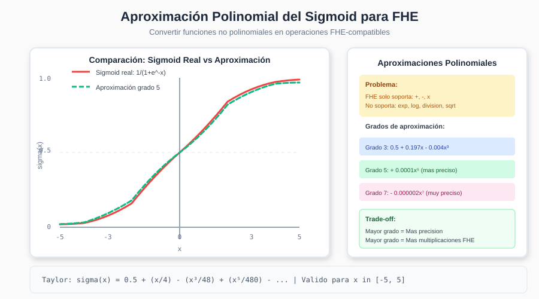

# Capítulo 4: Aproximaciones Polinomiales para FHE

## 4.1 La Necesidad de Aproximaciones

FHE solo puede evaluar **polinomios** de manera nativa. Cualquier función que no sea un polinomio debe ser aproximada.

### Funciones Comunes en ML que Necesitan Aproximación

```
┌─────────────────────────────────────────────────────────────────────┐
│                FUNCIONES ML → APROXIMACIONES POLINOMIALES            │
├──────────────────┬──────────────────────────────────────────────────┤
│   Función        │   Uso en ML                                      │
├──────────────────┼──────────────────────────────────────────────────┤
│   sigmoid(x)     │   Regresión logística, puertas en LSTM          │
│   tanh(x)        │   Activación en RNN, normalización               │
│   ReLU(x)        │   Redes neuronales profundas                     │
│   softmax(x)     │   Clasificación multiclase                       │
│   exp(x)         │   Softmax, distribuciones probabilísticas        │
│   log(x)         │   Cross-entropy loss, información mutua          │
│   1/x            │   Normalización, softmax                         │
│   sqrt(x)        │   Normalización L2, desviación estándar          │
└──────────────────┴──────────────────────────────────────────────────┘
```

---

## 4.2 Métodos de Aproximación

### 4.2.1 Series de Taylor

La serie de Taylor aproxima una función alrededor de un punto:

```
f(x) = f(a) + f'(a)(x-a) + f''(a)(x-a)²/2! + f'''(a)(x-a)³/3! + ...
```

**Para sigmoid alrededor de x=0:**

```
σ(x) = 1/(1 + e^(-x))

Derivadas en x=0:
σ(0) = 0.5
σ'(0) = 0.25
σ''(0) = 0
σ'''(0) = -0.0417

Serie de Taylor:
σ(x) ≈ 0.5 + 0.25x + 0x² - 0.0208x³/3 + ...
     ≈ 0.5 + 0.25x - 0.0208x³ + ...
```

### 4.2.2 Aproximación Minimax

Minimiza el error máximo en un intervalo dado:

```
minimize max|f(x) - p(x)| para x ∈ [a, b]
```

**Ventaja sobre Taylor:** Distribuye el error uniformemente en el intervalo.

```
┌─────────────────────────────────────────────────────────────────────┐
│                   TAYLOR vs MINIMAX                                  │
├─────────────────────────────────────────────────────────────────────┤
│                                                                       │
│   Error de Taylor:                 Error de Minimax:                 │
│                                                                       │
│      ^                                ^                              │
│      │     *                          │   *      *                   │
│   e  │   *                         e  │ *   *  *                     │
│   r  │  *                          r  │*     **                      │
│   r  │ *                           r  ├─*──────*─────                │
│   o  ├*───────────────             o  │                              │
│   r  │                             r  │                              │
│      └──────────────►                 └──────────────►               │
│              x                                x                      │
│                                                                       │
│   Error crece en extremos         Error uniforme                     │
│   del intervalo                   (equiripple)                       │
│                                                                       │
└─────────────────────────────────────────────────────────────────────┘
```

### 4.2.3 Aproximación de Chebyshev

Usa polinomios de Chebyshev como base:

```
T₀(x) = 1
T₁(x) = x
T₂(x) = 2x² - 1
T₃(x) = 4x³ - 3x
T₄(x) = 8x⁴ - 8x² + 1
...

f(x) ≈ Σᵢ cᵢ · Tᵢ(x)
```

**Ventaja:** Mejor comportamiento numérico que potencias estándar.

---

## 4.3 Aproximación del Sigmoid



### 4.3.1 Coeficientes para Diferentes Grados

```python
# Aproximaciones del sigmoid para FHE
# Rango válido: x ∈ [-5, 5]

SIGMOID_COEFFS = {
    # Grado 3 (1 multiplicación FHE)
    3: [0.5, 0.197, 0.0, -0.004],

    # Grado 5 (2 multiplicaciones FHE)
    5: [0.5, 0.197, 0.0, -0.004, 0.0, 0.00008],

    # Grado 7 (3 multiplicaciones FHE)
    7: [0.5, 0.197, 0.0, -0.004, 0.0, 0.00008, 0.0, -0.000002],
}

def sigmoid_poly(x, degree=5):
    """Evalúa aproximación polinomial del sigmoid."""
    coeffs = SIGMOID_COEFFS[degree]
    result = coeffs[-1]
    for c in reversed(coeffs[:-1]):
        result = result * x + c
    return result
```

### 4.3.2 Error de Aproximación

| Grado | Error máximo | Multiplicaciones FHE |
|-------|--------------|---------------------|
| 3 | ~0.05 | 1 |
| 5 | ~0.01 | 2 |
| 7 | ~0.002 | 3 |
| 9 | ~0.0005 | 4 |

### 4.3.3 Implementación Eficiente (Método de Horner)

```python
def sigmoid_fhe(x_encrypted, degree=5):
    """
    Evalúa sigmoid usando método de Horner para minimizar
    profundidad multiplicativa.

    Horner: p(x) = c₀ + x(c₁ + x(c₂ + x(c₃ + ...)))

    Esto reduce n multiplicaciones a log₂(n) en profundidad.
    """
    coeffs = SIGMOID_COEFFS[degree]

    # Calcular potencias necesarias de x
    x2 = x_encrypted * x_encrypted  # x²
    x3 = x2 * x_encrypted           # x³

    if degree >= 5:
        x4 = x2 * x2                # x⁴
        x5 = x4 * x_encrypted       # x⁵

    # Combinar términos (evitar profundidad secuencial)
    # Agrupar: (c₀ + c₁x) + x²(c₂ + c₃x) + x⁴(c₄ + c₅x)
    term1 = coeffs[0] + coeffs[1] * x_encrypted
    term2 = (coeffs[2] + coeffs[3] * x_encrypted) * x2

    if degree >= 5:
        term3 = (coeffs[4] + coeffs[5] * x_encrypted) * x4
        return term1 + term2 + term3
    else:
        return term1 + term2
```

---

## 4.4 Aproximación de Funciones de Activación

### 4.4.1 ReLU Aproximado

ReLU: `max(0, x)` no es diferenciable y requiere comparación.

**Aproximaciones comunes:**

```
┌─────────────────────────────────────────────────────────────────────┐
│                    APROXIMACIONES DE ReLU                            │
├─────────────────────────────────────────────────────────────────────┤
│                                                                       │
│   1. Cuadrado (simple):                                              │
│      ReLU(x) ≈ x² / (2·range)   para x ∈ [-range, range]           │
│                                                                       │
│   2. Suave (softplus escalado):                                      │
│      ReLU(x) ≈ (1/α) · log(1 + e^(αx))                              │
│      aproximado por polinomio                                        │
│                                                                       │
│   3. Polinomio optimizado:                                           │
│      ReLU(x) ≈ 0.5x + 0.25x² / range + pequeños términos            │
│                                                                       │
└─────────────────────────────────────────────────────────────────────┘
```

**Implementación:**

```python
def relu_approx_quadratic(x_encrypted, alpha=0.5):
    """
    Aproximación cuadrática de ReLU.

    Para x >= 0: ReLU(x) = x
    Para x < 0: ReLU(x) = 0

    Aproximamos con: ReLU(x) ≈ α·(x + |x|)
    donde |x| ≈ sqrt(x² + ε) aproximado por polinomio.
    """
    x2 = x_encrypted * x_encrypted

    # Aproximar sqrt(x² + ε) ≈ |x|
    # Usando expansión de Taylor de sqrt(1 + u) alrededor de u=0
    # sqrt(x² + ε) ≈ x·(1 + 0.5·ε/x² - 0.125·ε²/x⁴ + ...)

    # Simplificación práctica:
    abs_approx = x2 * 0.5 + 0.5  # Muy aproximado

    result = (x_encrypted + abs_approx) * alpha
    return result
```

### 4.4.2 Tanh Aproximado

`tanh(x) = 2·sigmoid(2x) - 1`

```python
def tanh_approx_fhe(x_encrypted, degree=5):
    """
    tanh(x) basado en sigmoid:
    tanh(x) = 2·σ(2x) - 1
    """
    scaled = x_encrypted * 2
    sigmoid_result = sigmoid_fhe(scaled, degree)
    return sigmoid_result * 2 - 1

# Alternativa: coeficientes directos para tanh
TANH_COEFFS = {
    3: [0.0, 0.96, 0.0, -0.167],
    5: [0.0, 0.96, 0.0, -0.167, 0.0, 0.008],
    7: [0.0, 0.96, 0.0, -0.167, 0.0, 0.008, 0.0, -0.0003],
}
```

---

## 4.5 Softmax para FHE

El softmax es crítico para clasificación multiclase pero requiere:
1. Exponenciales
2. División (normalización)

### 4.5.1 Desafío del Softmax

```
softmax(xᵢ) = exp(xᵢ) / Σⱼ exp(xⱼ)

Problemas:
- exp no es polinomio
- División no es soportada
- Overflow numérico potencial
```

### 4.5.2 Aproximación por Goldschmidt

El algoritmo de Goldschmidt aproxima divisiones iterativamente:

```
Para calcular 1/d:

1. Encontrar r₀ tal que d·r₀ ≈ 1 (estimación inicial)
2. Iterar:
   eₙ = 1 - d·rₙ
   rₙ₊₁ = rₙ·(1 + eₙ)

Cada iteración duplica los bits de precisión.
```

### 4.5.3 Implementación Completa

```python
class SoftmaxFHE:
    def __init__(self, n_classes, exp_degree=4, inv_iters=3):
        self.n_classes = n_classes
        self.exp_degree = exp_degree
        self.inv_iters = inv_iters

        # Coeficientes para exp aproximado
        self.exp_coeffs = self._compute_exp_coeffs(exp_degree)

    def _exp_approx(self, x_encrypted):
        """
        exp(x) ≈ 1 + x + x²/2 + x³/6 + x⁴/24 + ...
        Válido para x ∈ [-2, 2] (escalar x primero si necesario)
        """
        result = self.exp_coeffs[0]  # 1
        x_power = x_encrypted

        for i in range(1, len(self.exp_coeffs)):
            result = result + x_power * self.exp_coeffs[i]
            x_power = x_power * x_encrypted

        return result

    def _inverse_goldschmidt(self, d_encrypted, initial_guess=0.1):
        """
        Calcula 1/d usando Goldschmidt.

        d: valor a invertir (encriptado)
        initial_guess: estimación de 1/d (plaintext)
        """
        r = d_encrypted * 0 + initial_guess  # r₀

        for _ in range(self.inv_iters):
            e = 1 - d_encrypted * r  # e = 1 - d·r
            r = r * (1 + e)           # r = r·(1 + e)

        return r

    def forward(self, logits_encrypted):
        """
        Calcula softmax sobre logits encriptados.

        logits: lista de K valores encriptados [z₁, z₂, ..., zₖ]
        returns: lista de K probabilidades encriptadas
        """
        # 1. Estabilidad numérica: restar máximo
        # (en FHE aproximamos el máximo o lo ignoramos)

        # 2. Calcular exp para cada logit
        exp_values = [self._exp_approx(z) for z in logits_encrypted]

        # 3. Sumar todos los exp
        total = exp_values[0]
        for exp_v in exp_values[1:]:
            total = total + exp_v

        # 4. Calcular inverso de la suma
        inv_total = self._inverse_goldschmidt(total)

        # 5. Normalizar
        probs = [exp_v * inv_total for exp_v in exp_values]

        return probs
```

---

## 4.6 Inverso y División

### 4.6.1 Newton-Raphson para 1/x

```
Para encontrar r = 1/d:

f(r) = 1/r - d = 0

Newton-Raphson:
rₙ₊₁ = rₙ - f(rₙ)/f'(rₙ)
     = rₙ - (1/rₙ - d)/(-1/rₙ²)
     = rₙ·(2 - d·rₙ)
```

**Implementación:**

```python
def inverse_newton(d_encrypted, initial_guess, n_iters=4):
    """
    Calcula 1/d usando Newton-Raphson.

    Converge cuadráticamente (duplica precisión cada iteración).
    """
    r = d_encrypted * 0 + initial_guess

    for _ in range(n_iters):
        # r = r · (2 - d · r)
        dr = d_encrypted * r
        r = r * (2 - dr)

    return r
```

### 4.6.2 Raíz Cuadrada

Para calcular `sqrt(x)`:

```
Newton-Raphson para r = sqrt(x):
f(r) = r² - x = 0
rₙ₊₁ = (rₙ + x/rₙ) / 2

Pero división es costosa. Alternativa - calcular 1/sqrt(x):
f(r) = 1/r² - x = 0
rₙ₊₁ = rₙ · (3 - x·rₙ²) / 2

Entonces: sqrt(x) = x · (1/sqrt(x))
```

```python
def sqrt_newton(x_encrypted, initial_guess, n_iters=4):
    """
    Calcula sqrt(x) vía 1/sqrt(x) con Newton-Raphson.
    """
    # Calcular 1/sqrt(x)
    r = x_encrypted * 0 + initial_guess

    for _ in range(n_iters):
        r2 = r * r
        xr2 = x_encrypted * r2
        r = r * (3 - xr2) * 0.5

    # sqrt(x) = x · (1/sqrt(x))
    return x_encrypted * r
```

---

## 4.7 Optimización de Profundidad

### 4.7.1 Baby-step Giant-step

Para evaluar polinomio de grado alto con mínima profundidad:

```
┌─────────────────────────────────────────────────────────────────────┐
│                     BABY-STEP GIANT-STEP                             │
├─────────────────────────────────────────────────────────────────────┤
│                                                                       │
│   Para p(x) = Σᵢ₌₀ⁿ cᵢxⁱ                                            │
│                                                                       │
│   1. Elegir k ≈ √n                                                   │
│                                                                       │
│   2. Baby steps: calcular {x, x², ..., xᵏ}                          │
│      Profundidad: log₂(k)                                            │
│                                                                       │
│   3. Agrupar términos:                                               │
│      p(x) = q₀(x) + xᵏ·q₁(x) + x²ᵏ·q₂(x) + ...                      │
│      donde qⱼ(x) = Σᵢ₌₀ᵏ⁻¹ cⱼₖ₊ᵢ·xⁱ                                 │
│                                                                       │
│   4. Giant steps: combinar los qⱼ                                    │
│      Profundidad adicional: log₂(n/k)                                │
│                                                                       │
│   Profundidad total: O(log n) en lugar de O(n)                       │
│                                                                       │
└─────────────────────────────────────────────────────────────────────┘
```

### 4.7.2 Ejemplo: Grado 8

```python
def eval_degree8_optimized(x_encrypted, coeffs):
    """
    Evalúa polinomio de grado 8 con profundidad 3 en lugar de 8.

    p(x) = c₀ + c₁x + c₂x² + c₃x³ + c₄x⁴ + c₅x⁵ + c₆x⁶ + c₇x⁷ + c₈x⁸

    Agrupamos con k=3:
    p(x) = (c₀ + c₁x + c₂x²) + x³(c₃ + c₄x + c₅x²) + x⁶(c₆ + c₇x + c₈x²)
    """
    # Baby steps: calcular potencias hasta x³
    x2 = x_encrypted * x_encrypted         # Profundidad 1
    x3 = x2 * x_encrypted                   # Profundidad 2
    x6 = x3 * x3                            # Profundidad 3

    # Evaluar sub-polinomios (todos en paralelo, misma profundidad)
    q0 = coeffs[0] + coeffs[1]*x_encrypted + coeffs[2]*x2
    q1 = coeffs[3] + coeffs[4]*x_encrypted + coeffs[5]*x2
    q2 = coeffs[6] + coeffs[7]*x_encrypted + coeffs[8]*x2

    # Giant steps: combinar
    result = q0 + x3*q1 + x6*q2             # Profundidad 4

    return result
```

---

## 4.8 Manejo del Rango de Entrada

### 4.8.1 Problema de Rango

Las aproximaciones polinomiales solo son válidas en un rango limitado:

```
sigmoid aproximado: válido para x ∈ [-5, 5]
exp aproximado: válido para x ∈ [-3, 3]
sqrt aproximado: válido para x ∈ [0.1, 10]
```

### 4.8.2 Soluciones

```
┌─────────────────────────────────────────────────────────────────────┐
│                    MANEJO DE RANGO EN FHE                            │
├─────────────────────────────────────────────────────────────────────┤
│                                                                       │
│   1. PRE-PROCESAMIENTO (antes de encriptar):                         │
│      • Normalizar datos a rango esperado                             │
│      • Clip valores extremos                                         │
│                                                                       │
│   2. ESCALADO EN MODELO:                                             │
│      • Ajustar pesos para que activaciones estén en rango           │
│      • Batch normalization antes de activaciones                     │
│                                                                       │
│   3. APROXIMACIONES COMPUESTAS:                                      │
│      • Diferentes polinomios para diferentes rangos                  │
│      • Interpolación suave entre ellos                               │
│                                                                       │
│   4. CLAMP APROXIMADO:                                               │
│      • clamp(x, -L, L) ≈ L · tanh(x/L)                              │
│      • Suaviza valores extremos                                      │
│                                                                       │
└─────────────────────────────────────────────────────────────────────┘
```

### 4.8.3 Implementación de Clamp Suave

```python
def soft_clamp(x_encrypted, limit=5.0, degree=5):
    """
    Implementa clamp suave: valores fuera de [-limit, limit]
    se suavizan hacia los límites.

    clamp(x) ≈ limit · tanh(x / limit)
    """
    scaled = x_encrypted * (1.0 / limit)
    tanh_result = tanh_approx_fhe(scaled, degree)
    return tanh_result * limit
```

---

## 4.9 Selección de Aproximación

### 4.9.1 Guía de Decisión

```
┌─────────────────────────────────────────────────────────────────────┐
│                 SELECCIÓN DE APROXIMACIÓN                            │
├─────────────────────────────────────────────────────────────────────┤
│                                                                       │
│   ¿Cuánta precisión necesitas?                                       │
│   │                                                                   │
│   ├─► Alta (error < 0.001)                                           │
│   │   └─► Usa grado 7+ o métodos iterativos                         │
│   │       Costo: 3+ niveles multiplicativos                          │
│   │                                                                   │
│   ├─► Media (error < 0.01)                                           │
│   │   └─► Usa grado 5                                                │
│   │       Costo: 2 niveles multiplicativos                           │
│   │                                                                   │
│   └─► Baja (error < 0.05)                                            │
│       └─► Usa grado 3                                                │
│           Costo: 1 nivel multiplicativo                              │
│                                                                       │
│   ¿Cuántos niveles FHE tienes disponibles?                          │
│   │                                                                   │
│   ├─► Pocos (L < 5): Prioriza aproximaciones de grado bajo          │
│   │                                                                   │
│   └─► Muchos (L > 10): Puedes usar aproximaciones precisas          │
│                                                                       │
└─────────────────────────────────────────────────────────────────────┘
```

### 4.9.2 Tabla de Referencia

| Función | Método Recomendado | Grado Típico | Niveles FHE |
|---------|-------------------|--------------|-------------|
| sigmoid | Taylor/Minimax | 5-7 | 2-3 |
| tanh | Via sigmoid ×2-1 | 5-7 | 2-3 |
| ReLU | Cuadrático | 2 | 1 |
| exp | Taylor | 4-6 | 2-3 |
| 1/x | Newton 4 iters | - | 4 |
| sqrt | Newton 3 iters | - | 3 |
| softmax | exp + Goldschmidt | - | 5-7 |

---

## 4.10 Resumen del Capítulo

| Técnica | Descripción | Uso Principal |
|---------|-------------|---------------|
| **Taylor** | Expansión en serie | Funciones suaves |
| **Minimax** | Minimiza error máximo | Precisión uniforme |
| **Chebyshev** | Base ortogonal | Estabilidad numérica |
| **Newton-Raphson** | Iterativo para inversiones | 1/x, sqrt |
| **Goldschmidt** | División iterativa | Softmax |
| **Baby-giant step** | Reduce profundidad | Polinomios largos |

---

## 4.11 Ejercicios

1. **Implementación**: Implementa una aproximación de `log(1+x)` de grado 4 válida para `x ∈ [0, 2]`.

2. **Análisis**: ¿Por qué Newton-Raphson converge cuadráticamente? ¿Cuántas iteraciones necesitas para 32 bits de precisión partiendo de 2 bits?

3. **Optimización**: Dado un polinomio de grado 16, ¿cuál es la profundidad mínima usando baby-step giant-step?

4. **Diseño**: Diseña una aproximación para `max(x, y)` usando solo operaciones FHE.

---

**Siguiente sección**: [Arquitectura General →](../guides/01-architecture.md)
